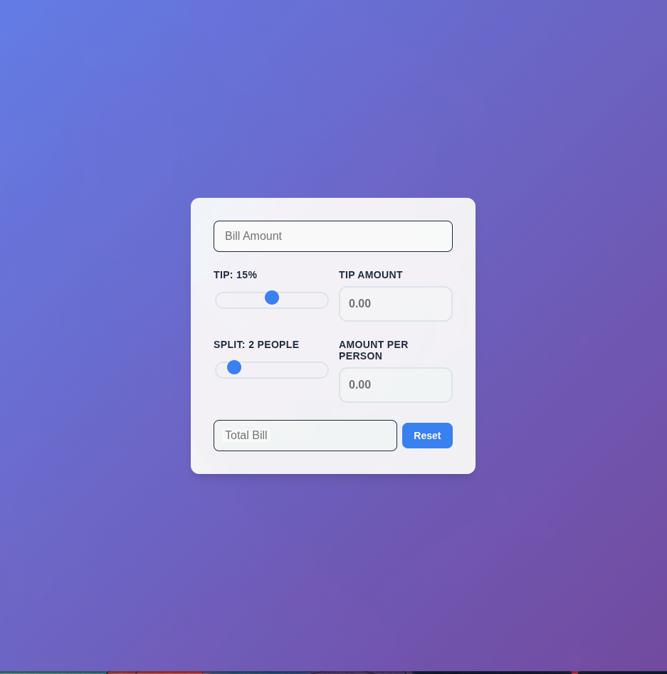

# Tip Calculator 💰🎉

**Day 2 of my 100-Day JavaScript Challenge**

A real-time tip calculator with **CONFETTI CELEBRATIONS** when you're generous!

## 🎨 Features

- 💵 Real-time tip calculation (no button needed!)
- 🎆 **Confetti animation** when reaching 20%, 25%, or 30% tip!
- 🎨 Canvas-based particle effects with physics simulation
- ✨ Beautiful floating label inputs
- 🎚️ Interactive range sliders
- 🔄 Reset button to start fresh
- 📱 Fully responsive design
- 🎯 Professional gradient UI

## 🛠️ Technologies Used

- HTML5 Canvas API
- CSS3 (Flexbox, Gradients, Transitions, Floating Labels)
- Vanilla JavaScript (Classes, OOP, Animation Loops, Particle Systems)

## 💡 What I Learned

- **Canvas API** - Drawing graphics and animations
- **Object-Oriented Programming** - Using classes for particle system
- **requestAnimationFrame** - Creating smooth 60fps animations
- **Particle Systems** - Physics simulation with gravity and rotation
- **Event-Driven Programming** - Triggering effects on user actions
- **Floating Labels** - Professional form UI patterns
- Real-time calculations with input event listeners

## 🎆 The Confetti System

Built a complete particle physics system:

- Each confetti piece is an object with position, velocity, rotation
- Gravity pulls particles down over time
- Particles fade out and spin as they fall
- Different burst intensities for different tip amounts:
  - 20% tip → 50 confetti pieces
  - 25% tip → 100 confetti pieces
  - 30% tip → 275 confetti pieces (3 bursts!)

## 🐛 Challenges

- Attempted carousel picker (didn't work today)
- **Pivoted to confetti animations instead!**
- Learned that sometimes the best feature isn't the one you planned
- **Learned**: Adapt, don't give up!

## 🚀 Live Demo

[View Live Project](https://exc1d.github.io/day-02-tip-calculator/)

**Try it:** Move the tip slider to 30% and watch the confetti explode! 🎉

## 👨‍💻 Development Process

**Time spent:** ~X hours
**Approach:** MVP first → Attempted carousel → Pivoted to confetti → Shipped!

Built with ❤️ on Day 2 of my journey to becoming a Full Stack Developer!

---

**For Joy, Hero, Aiah, and Aria** 🐕💙
